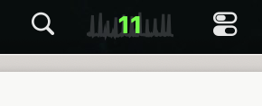
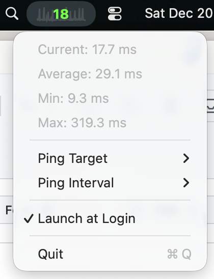

# IsItMe

A macOS menu bar app that monitors network latency with a live sparkline graph.

*Is it me, or is the internet slow?*





## What it does

Shows ping latency in your menu bar with:
- Color-coded numbers (green < 30ms, yellow 30-100ms, red > 100ms)
- 2-minute sparkline graph showing latency trends
- Visual indicators for connection drops
- Stats: current, average, min, max

## Building

Requires Xcode 15+ and macOS 12+

```bash
git clone https://github.com/yourusername/IsItMe.git
cd IsItMe
open IsItMe.xcodeproj
```

Build and run (⌘R)

## Features

- Ping any host (default: 1.1.1.1)
- Adjustable interval (0.5s, 1s, 2s, 5s)
- Launch at login option
- Sparkline shows history with gaps for outages

## Usage

Click the menu bar icon to:
- View detailed stats
- Change ping target
- Adjust ping interval
- Toggle launch at login

Move the icon: Hold ⌘ and drag

## License

MIT
